# Projeto Agrinho : Fresh Farm Market

<h1 align="center">

</h1>

## Index 
- [about](#sobre-o-projeto)
- [ferramentas](#️-ferramentas-utilizadas)
- [páginas do site](#paginas-dos-setores-do-site)
- [elementos visuais](#elementos-visuais)

## Sobre o projeto

 A idea de criação deste site veio da dificuldade que o **agricultor familiar** tem em vender seus produtos, como exemplo a **mãe do desenvolvedor** que tinha **dificuldade de divulgar seus produtos** caseiros, como **conservas, cervejas caseiras** e etc. Ela e muitos outros **pequenos agricultores familiares** que tem produtos **incríveis e saborosos** até então **não tinham** um espaço no mercado pois os grandes agricultores podem vender para qualquer canto do mundo por **terem capacidade de transportar e entregar os produtos**. E para melhorar e facilitar o dia-a-dia dos pontos comerciais voltados para a **alimentação**, que buscam por **qualidade, agilidade, confiança preço baixo**. Podem encontrar isso tudo aqui, através do nosso **sistema de avaliação inovador**. Este site foi inteiramente criado pelo aluno **Airton Gabriel Kendzierski**, tendo colaboração somente de **Luis Henrique Lechiv** (fornecedor de conteudo de ensino) e **Priscila Padilha** (desenvolvedora da paleta de cores). Sendo assim, a **Fresh Farm Market** transforma a realidade dos **pequenos agricultores**, lhes apresentando um espaço preparado para eles, onde eles podem aumentar seu **reconhecimento**, trabalhando como **fornecedores**!

 ## 🛠️ Ferramentas utilizadas

 - [bootstrap]( https://github.com/twbs/bootstrap/blob/3083596e87146c1c5a61de7238cb69e1dab5ae8b/LICENSE) ícones do site

 - [pixabay](https://pixabay.com/pt/service/license-summary/) banco de imagens gratuito

- [design](https://www.bing.com/new/termsofuseimagecreator?FORM=GENTOS) gerador de imagens

- [google fonts](https://fonts.google.com/) fontes utilizadas

# Funcionalidade do site

# homepage

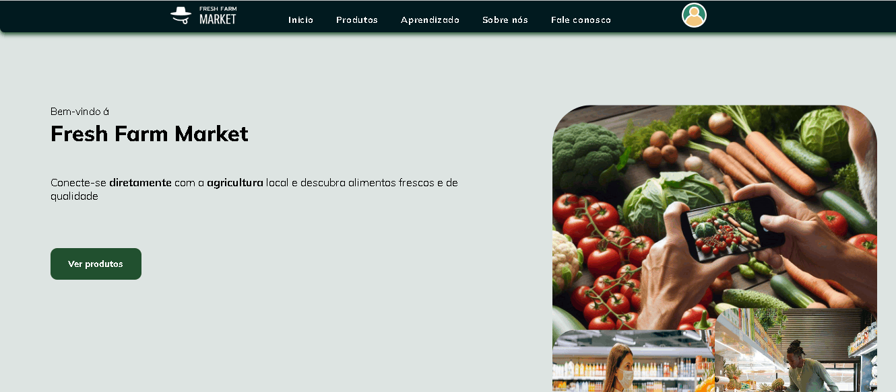

-  Esta é a heropage, parte de **entrada** do site. Aqui e nas outras páginas, posui o header onde exixte o **menu de navegação**, contituido por uma imagem da **logo do site**, as 5 opções de **navegação**, e o icone de **perfil** que direciona o usuário para uma **página de login.**

-  abaixo do header está o conteudo de acolhimento do site, onde possui o **texto convidativo**, o **botão principal** que vai para a estante de produtos, e naz versões de tela maiores, possui as imagens de ilustração que posuem uma animação, que se assemelha a uma levitação
 
 
 
 
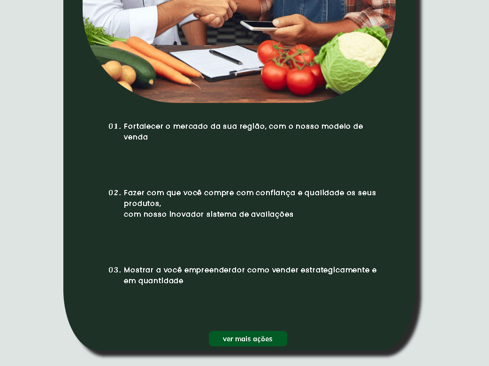

## apresentação das intenções do site

-  nesta parte o usuário verá uma imagem, uma lista com três tópicos e um **botão** que vai para página de **"Sobre nós"**

- o intuito desta seção é apresentar ao usuário, de que forma o site pode **auxiliá-lo** apresentando **três** itens importantes sobre o site e ao **clicar no botão** ele verá **mais sobre o site**
 
 
 
 
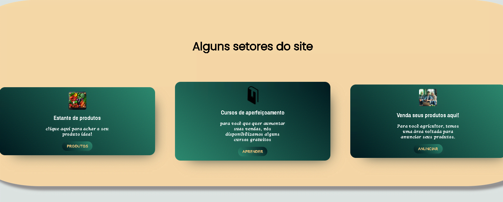

## Apresentação das intenções do site

### Nesta seção é apresentado o **caminho** para os **principais setores do site**:

- **Estante de produtos** onde estão todos os produtos publicados no site 

- **cursos de aperfeiçoamento** onde os usuários podem abrangir seus conhecimentos de **marketing digital** e melhoras seus anuncios publicados 

- **anunciar** local que dá **toda** a funcionalidade do site, pois neste local os **fornecedores** colocam seus produtos no ar

- ## para acessar os setores, basta clicar no botão intuitivo abaixo da descrição de cada card
 
 
 
 
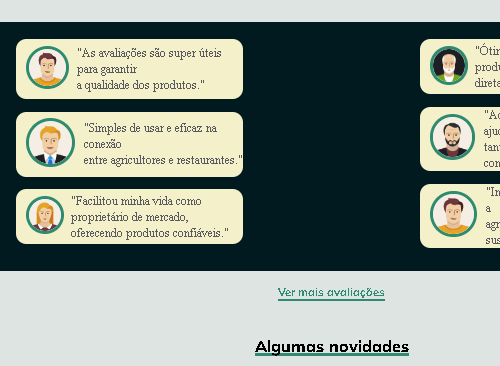

## abaixo da sessão de setores possui  a sessão de >avaliações do site< onde possui um link quebrado para uma pagina que ainda está em desenvolvimento, porém os comentários ja presentes, já conseguem trazer uma ideia de como esta o site
 
 
 
 
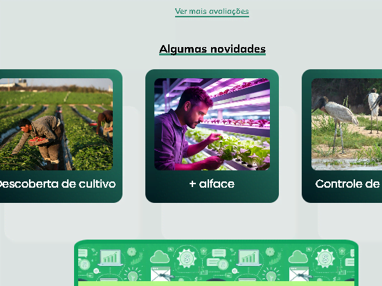

## Esta é a sessão de novidades onde os desenvolvedores publicam as novidades presentes no site

- porém esta sessão está apenas para **demostração** pois **não possui a página de novidades ainda**

 
 
 
 

## Esta é a sessão de acesso para a página do curso 

- possui um **botão** de ao clicá-lo direciona o usuário para a **pagina de aprendizado** onde está aberto uma video aula retirada do youtube, de **Gustavo Guanabara**
 
 
 
 

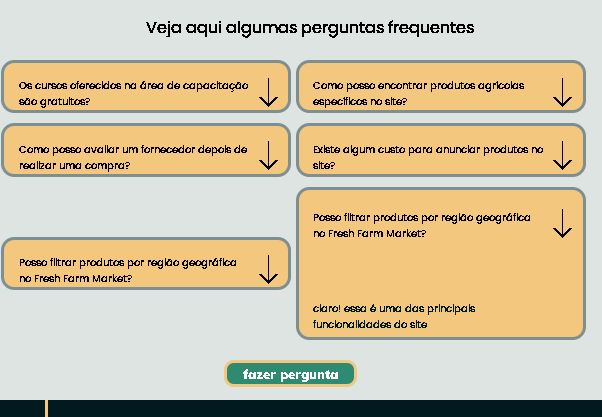

## Logo abaixo á sessaõ de perguntas frequentes onde onde possui algumas perguntas que ao passar o cursor ou clicar encima apresenta a resposta para esta perunta

- caso sua dúvida seja outra, existe o botão de **fazer pergunta** após **clicá-lo** o usuário será direcionado para a página de **contate-nos**

 
 
 
 

## footer

 E por fim o **rodapé** do site **presente também em quase todas as páginas** do site com algumas opções que direcionam o usuário para suas respactivas sessôes e páginas

 
 
 
 
 
 
 
 

# Páginas dos setores do site

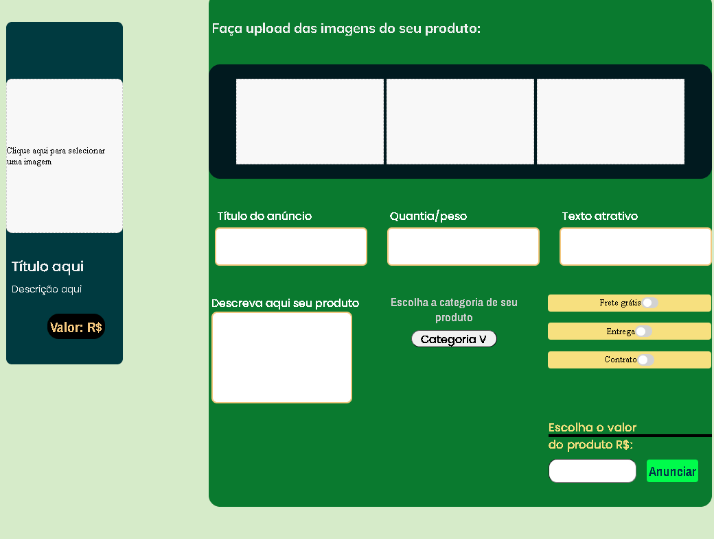

## Nesta página, o usuário que quer ser fornecedor, anuncia seus produtos. Pode parecer complexa, mais as funcionalidades são bem intuitivas na prática, aqui abaixo está a esplicação de cada opção :

- **visualização do anúncio :** esta opção é o retangulo em pé que possui um espaço em banco com uma escrita no meio, ali ficará a imagem principal do anúncio, para adicioná-la basta clicar em qualquer lugar deste espaço. Abaixo o conteudo é apenas de demonstração pois não está inalterável para o usuário, com exceção da barra de valor, onde o valor é automaticamente alterado, quando o valor é definido no segundo quadro.

- **Iserssão das informações**

- abaixo do titulo, existe um campo de **upload de imagens**
com **espaço para três imagens**, para você leu o **tópico acima**, o modo de fazer upload das imagem é igual para os três campos

- logo abaixo, existe três espaços de digitação com o mesmo tamanho, estes são respectivamente: **titulo do produto**, **quantidade por unidade** e **texto atrativo**. Para usar estes campos basta **clicar no espaço em branco e digitar o texto**

- O espaço de digitação maior titulado como **"descreva seu produto"**, onde o **fornecedor** adicione uma descrição completa do produto.

- "escola a categoria do seu produto" este é um **menu dropdown** que possui as principais categorias do seu produto, nele o fornecdor informa em que categoria seu produto se encaixa

- **opções on/off :** são **três opções** adicionas presentes em espaços retangulares com **botôes switch** para utilizar, basta clicar

- **escolha o valor do produto :** este é o espaço onde o fornecedor **informa o valor do produto**, e o valor será **automaticamente alterado** no **quadro de vizualização**

- **proximo á opção de valor** está o **botão de confirmação** que ao clicar direciona o usuário para uma pagina que informa a **confirmação de publicação do anúncio.**

 
 
 
 
 
 
 
 

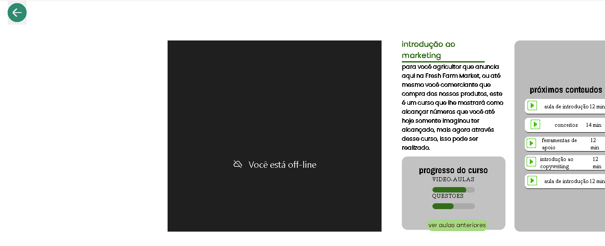

# Página de aprendizado

- ## existe a video aula, retirada do youtube

- abaixo ou **ao lado** está as inormações do curso como **introdução, progreço, e os próximos conteudos do curso.**

- esta página possui **um botão funcional** além do header e footer: 
- o **botão de voltar**, que direciona o usuário para a **homepage**

- o botão de **"ver aulas anteriores"**
é somente para **ilustração**

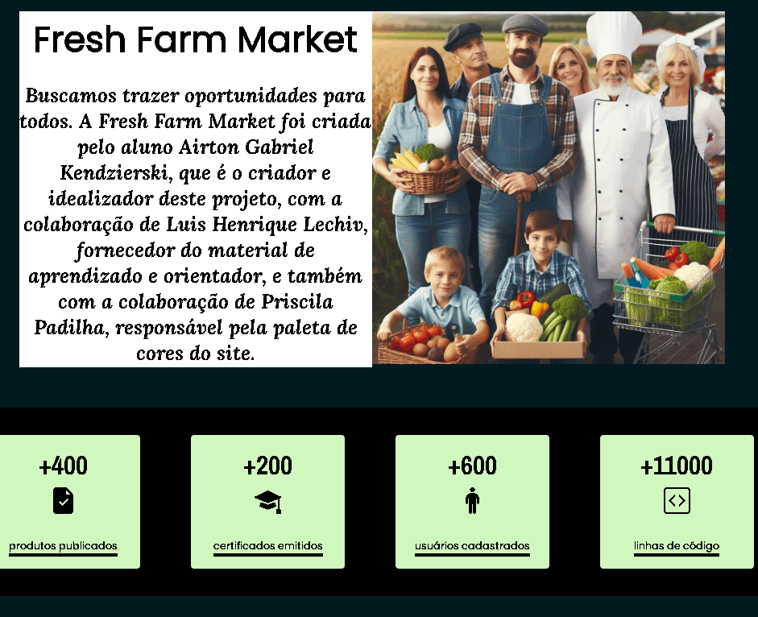

# Sobre nós

- esta página possui as informações do site, de como foi feito e de onde surgiu a ideia

-possui duas imagens geradas pelo [design](https://www.bing.com/new/termsofuseimagecreator?FORM=GENTOS) gerador de imagens, e uma imagem autoral do quadro tema, de onde foi estraído a paleta de cores do site.
 
 
 
 
 
 
 
 

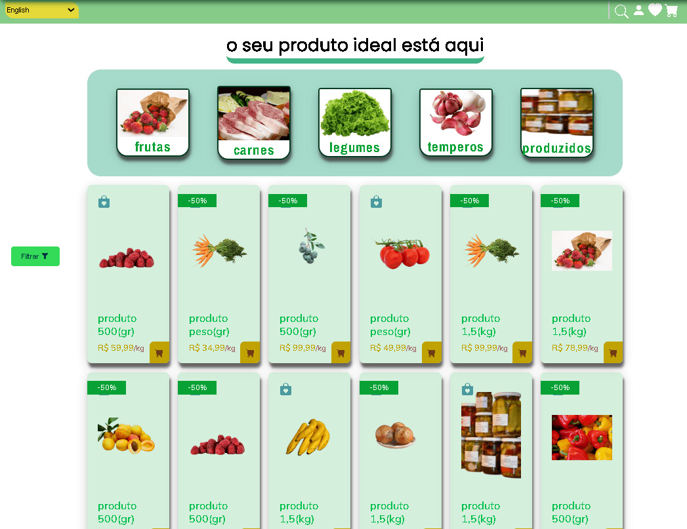

# Estante de produtos 

- é um dos três principais setores do site, este é o setor que atrai os dois públicos: **fornecedores e comerciante**

-onde o usuário fornecedor pode anunciar e o usuário comerciante pode comprar.

## funcionalidades:

### Abaixo do header possui o sub-header onde possui as seguintes funcionalidades:

- Ao lado esquedo, posui o **menu dropdown de linguagem**, este está somente para **ilustração**

- Ao lado direito, possui as opções de **pesquisa, perfil, favoritos, e carrinho de compras**, representadas respectivamente por :**lupa, icone de perfil, coração e carrinho de compras**. Das citadas duas estão funcionando, uma parcialmente e outra totalmente, respectivamente:

- Aesquisar: ao clicar na lupa o espaço de digitação abre, porém a seleção digitada não aparece.

- Aerfil: ao clicar no ícone de perfil, abre a pagina de perfil

### Abaixo possui a estante de produtos:

- Barra de **categorias** : é um espaço demonstrativo, que não está funcional. Este espaço tem o intuito de classificar por categoria os produtos da estante

- abaixo das categorias possui uma **grade de produtos publicados**, onde ao clicar em qualquer produto, vai para a **página de informações do produtos**

- É possivel vizualizar ao **lado esquerdo** um **botão verde de filtrar** que ao clicar abre uma aba de filtro, que atualmente está para **demostração**

 
 
 
 
 
 
 
 

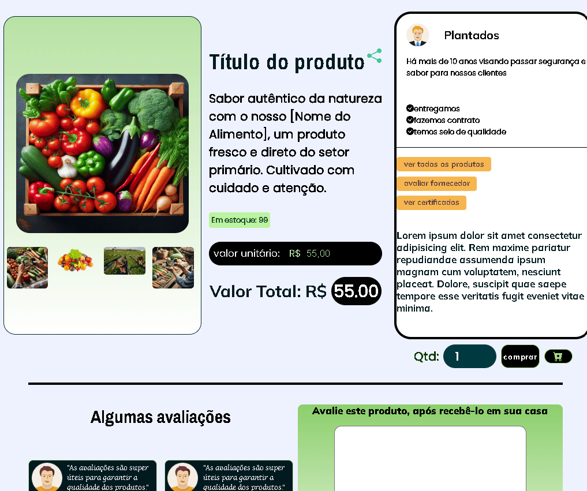

# Esta é a página de informações do produto, segue as funcionalidades:

## Esta é uma página generalizada, para ter sentido ao clicar em qualquel produto, pois o tempo impossibilitava a especificação de cada produto

- No espaço com a grade das imagens, não possui funcionalidade, ele contém uma imagem grande e principal, e as quatro imagens pequenas contendo também a principal e outras 3 imagens do produto.

- No quadro onde possui a descrição, valor do produto e valor total da compra. é apresentado a descrição, um botão de ilustração para **compartilhar**, o **valor unitário definido pelo desenvolvedor** e o **valor total de compra** que atualiza automaticamente ao mudar a quantidade

- Um espaço de informações do fornecedor, com o botão de **avaliar fornecedor** funcionando, qua ao clicar, leva para a página de avaliar.

- Botão de **comprar** que ao clicar, leva o usuário para uma página de comfirmação de compra

 
 
 
 
 
 
 
 

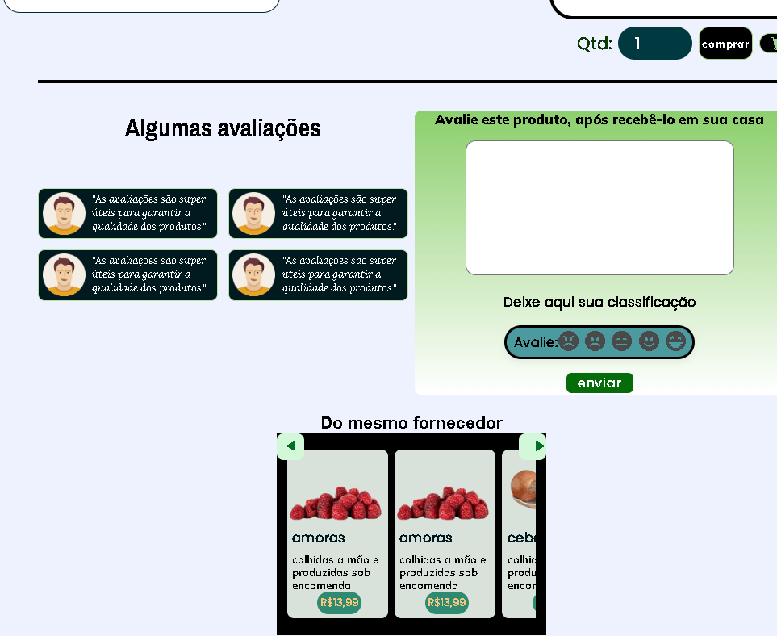

# Parte inferior da página do produto

## esta sessão é secundária, contendo, três artigos:

- ### Avaliações:
onde o usuário pode ver as avaliações dadas por outros usuários que compraram

- ### avaliar: 
após o usuário receber o produto em casa, ele precisa avaliar este produto, depois que ele avaliar o produto, é permitido a compra de outros produtos, a pagina de avaliação pode ser acessada pelo perfil.

- ### Produtos do mesmo fornecedor:

é um slider que mostra algums produtos do mesmo fornecedor, para vizualizar todos os produtos basta clicar na **seta** para o slider rodar, para acessar os produtos basta clicar em qual se interessaar

 
 
 
 
 
 
 
 

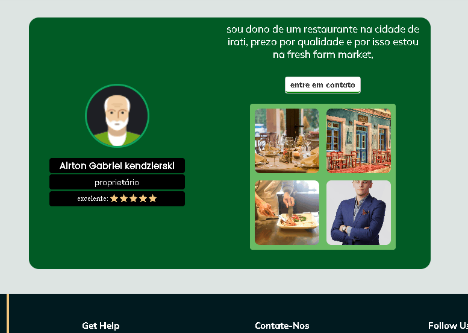

# Página de perfil:

- possui a imagem, nome, cargo, e sua avaliação
- abaixo destas informações, possui um link para **avaliar os produtos recebidos**
- uma descrição breve sopre o usuário e um botão de ilustração de **entrar em contato**, que ao **passar o mouse ou clicar**, mostra as **opções de contato**
- e uma grade imagens sobre o usuário

 
 
 
 
 
 
 
 

# Pagina de login:
É acessada ao clicar no icone de perfil no header

- possui uma area para **digitar o email**
- um área para **digitar a senha**
- se os dois campos forem digitados corretamente, o botão de **enviar** levará o usuário novamente para a home page

- abaixo tem icones de redes socias, para ilustração, que direcionam o usuário para as redes sociais do site

- um link alternativo : **criar uma conta**, que direciona o usuário para o cadastro.

 
 
 
 
 
 
 
 

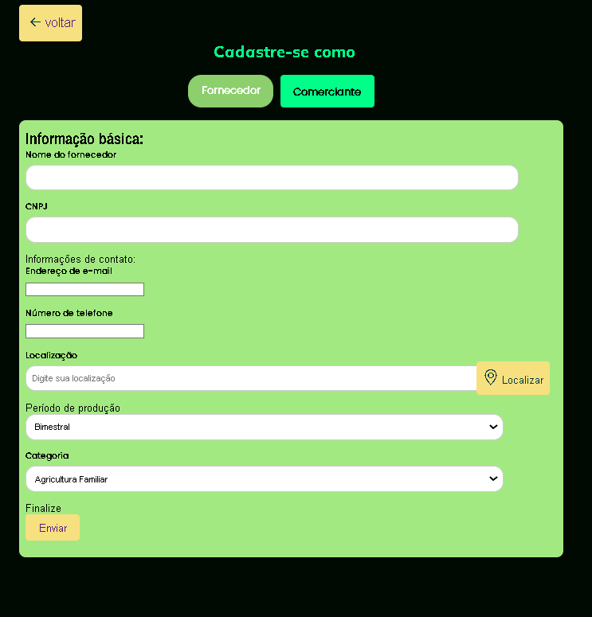

# Cadastre-se :
possui duas opções de cadastro, que podem ser acessadas através dos botoes verdes próximos a obotão de voltar, ao selecionar o modo de cadastro, será aberto o formulário de inscrição do usuário, o cadastro é bem intuitivol, contendo com um campo de entrada para a localização do usuário,  sendo fundamental para o cadastro.

 
 
 
 
 
 
 

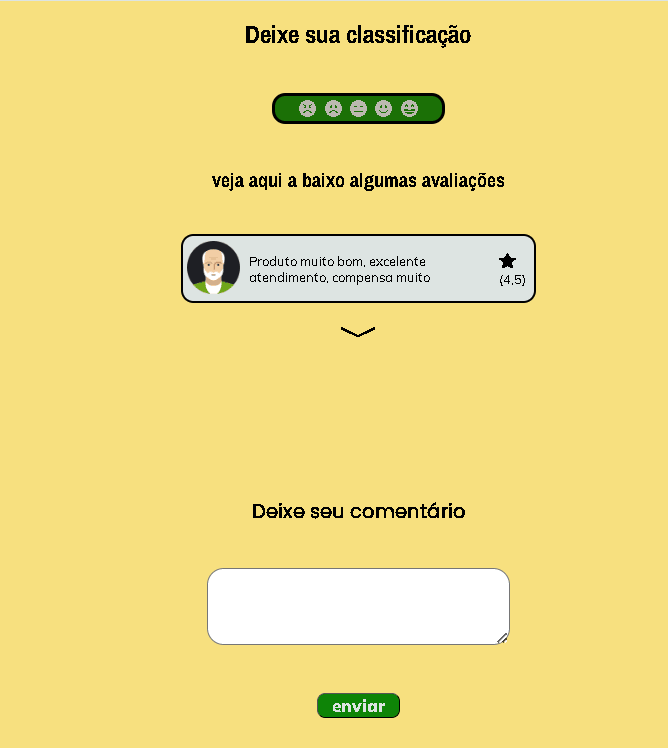

## avaliar o produto recebido 

Esta é uma página que vai ser muito utilizada pelos compradores, pois após o comprador receber seu produto em casa, ele precisa avaliar o produto, enquanto o produto não for avaliado o site não permitira ele efetuar uma nova compra, caso ele clique para comprar algum produto, será notificado, que **tem avaliações pendentes**, este método foi utilizado para **manter a integridade e qualidade** dos produtos do site

## Para avaliar: 

- acima exite um campo com uma classificação de 5 níveis, basta **clicar no nível escolhido**. Para deixar uma avaliação escrita, basta **clicar dentro da área de digitação** para inserir o texto

- para enviar o conteúdo de sua avaliação, clique no botão de **enviar**

## elementos visuais:

O site possui imagens feitas pela AI **Design**, e imagens extraidas do banco de imagens gratuito **pixabay**, também para a demonstração da página de aprendizado, foi adicionado um iframe contendo um curso disponível no Youtube, do **Gustavo Guanabara**

